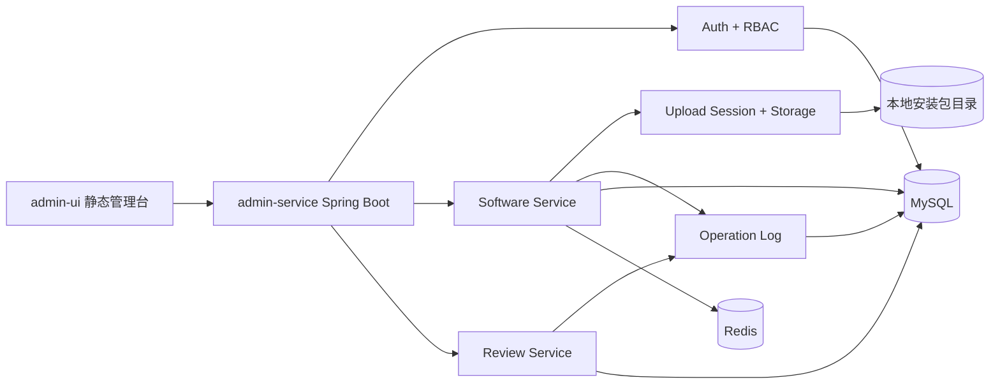
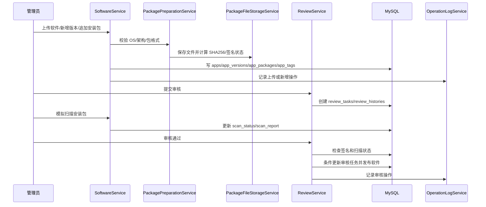
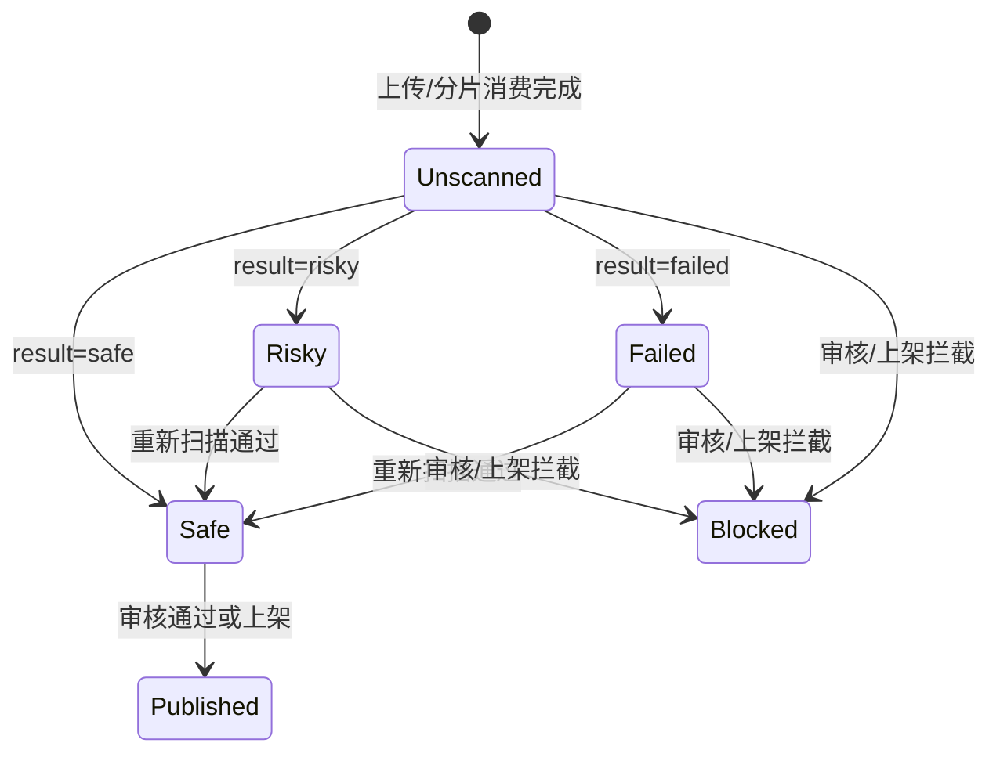

# 架构和核心流程图

这份文档用于快速说明项目为什么这样设计，以及主要业务链路如何流转。图里的模块名称尽量和代码包、数据库表保持一致，方便面试或代码走查时对照。

## 设计意图

项目是企业软件商店后台管理系统，核心不是普通 CRUD，而是把软件包从上传、校验、审核到上架的流程做成可追踪、可回滚、可拦截的后台闭环。

主要设计目标：

- 业务闭环清晰：软件、版本、安装包、审核任务和操作日志串起来。
- 状态可控：草稿、审核中、已上架、已下架、驳回等状态通过 Service 和 SQL 条件共同约束。
- 安全前置：密码哈希、Token 会话版本、RBAC、签名校验和扫描状态都进入主链路。
- 工程可讲：Service 分层、MyBatis XML、事务、缓存失效、审计和测试都有明确边界。

## 总体结构



## 上传到发布流程



## 鉴权和权限流程

```mermaid
flowchart TD
    Login[登录请求] --> UserDB[查询 admin_users]
    UserDB --> Password[BCrypt/兼容 SHA-256 校验]
    Password --> Token[签发 HMAC Token<br/>包含 tokenVersion 和 jti]
    Token --> Request[后台接口请求]
    Request --> Interceptor[AdminAuthInterceptor]
    Interceptor --> Verify[验签 + 过期时间 + 数据库账号状态]
    Verify --> Permission[@RequirePermission 权限点]
    Permission --> RBAC[查询角色权限]
    RBAC -->|通过| Controller[执行业务接口]
    RBAC -->|失败| Forbidden[403]
    Verify -->|失败| Unauthorized[401]
```

## 审核并发控制

```mermaid
flowchart TD
    Submit[提交审核] --> ActiveKey[review_tasks.active_review_key]
    ActiveKey --> Unique[uk_review_active_target<br/>限制同一软件/版本仅一条活动任务]
    Assign[分配审核人] --> AssignSql[UPDATE ... WHERE status = 0 AND reviewer_id IS NULL]
    Approve[审核通过/驳回] --> FinishSql[UPDATE ... WHERE status IN (0, 1)]
    FinishSql --> Affected{affected rows}
    Affected -->|1| Continue[写历史并更新业务状态]
    Affected -->|0| Conflict[返回审核任务已被其他人处理]
```

## 安装包安全状态



## 核心模块边界

| 模块 | 职责 |
| --- | --- |
| `auth` | 登录、Token、RBAC 权限管理和接口权限拦截 |
| `software` | 软件、版本、安装包、发布状态和缓存失效 |
| `review` | 审核任务、审核历史、分配、通过和驳回 |
| `operationlog` | 后台关键动作审计 |
| `category` / `tag` | 分类和标签基础数据 |
| `database/mysql` | 初始化 schema 和增量迁移 |

## 面试讲法

可以用一句话开场：

> 这个项目是企业软件商店后台，核心是把软件包上传、版本维护、安装包安全校验、审核任务、上下架和操作审计串成一个状态可控的后台流程。

然后按这条线展开：

1. 上传链路解决大文件和安全元数据问题。
2. 审核链路解决状态流转和并发覆盖问题。
3. 权限链路解决不同后台角色的操作边界。
4. 审计和缓存解决可追踪和查询性能问题。
