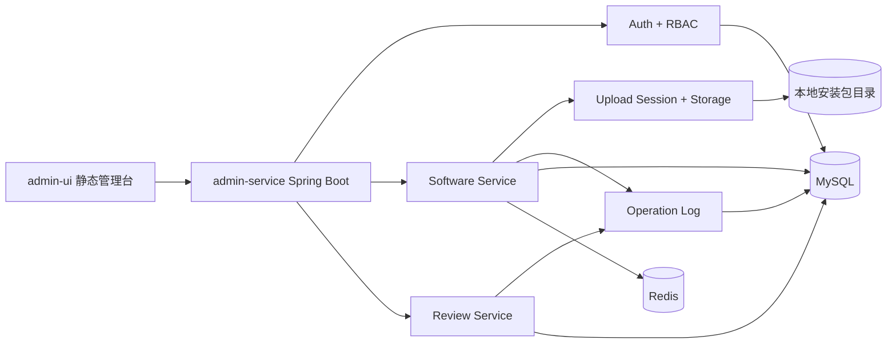
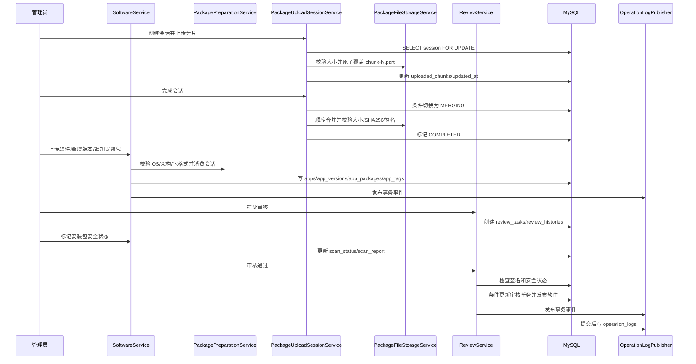
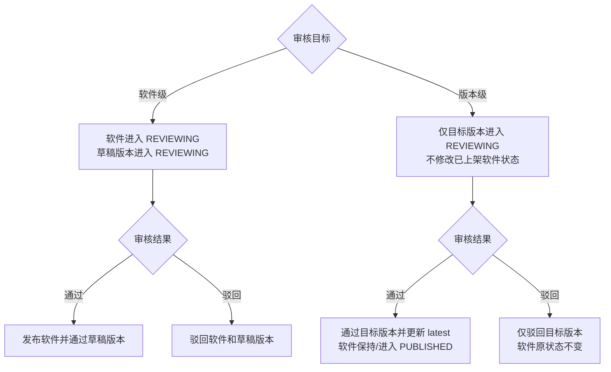
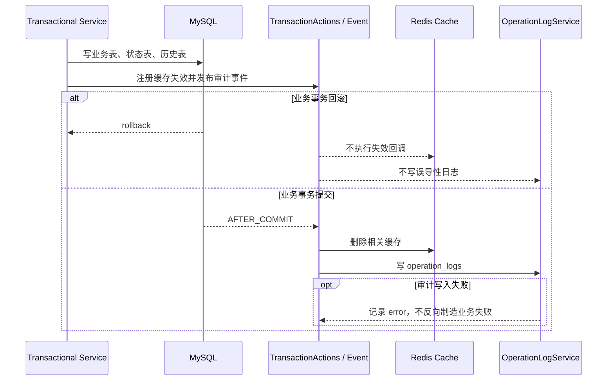
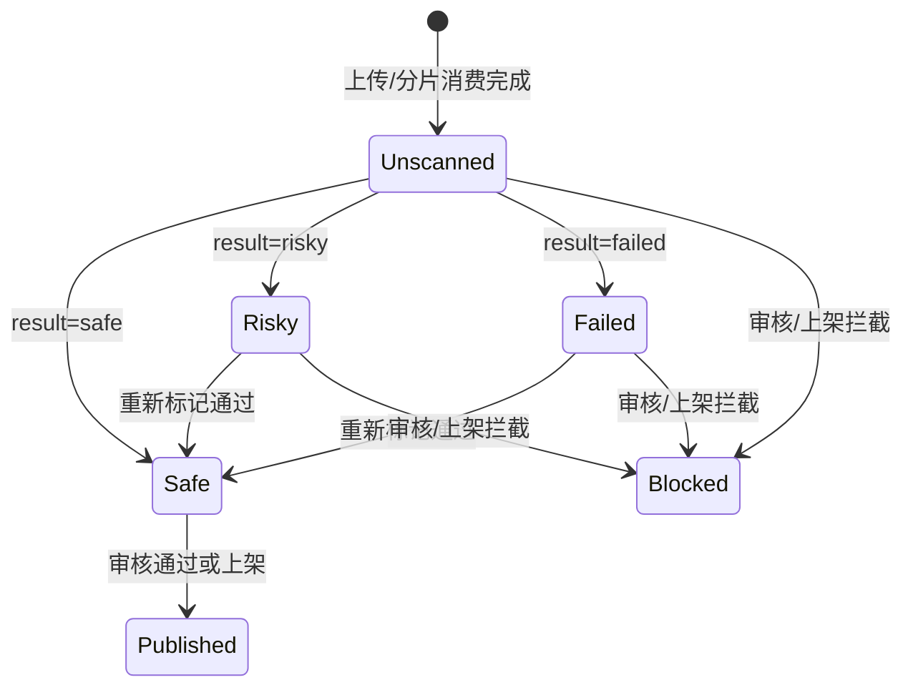

# 架构和核心流程图

这份文档用于快速说明项目为什么这样设计，以及主要业务链路如何流转。图里的模块名称尽量和代码包、数据库表保持一致，方便面试或代码走查时对照。

## 设计意图

项目是企业软件商店后台管理系统，核心不是普通 CRUD，而是把软件包从上传、校验、审核到上架的流程做成可追踪、可回滚、可拦截的后台闭环。

主要设计目标：

- 业务闭环清晰：软件、版本、安装包、审核任务和操作日志串起来。
- 状态可控：草稿、审核中、已上架、已下架、驳回等状态通过 Service 和 SQL 条件共同约束。
- 并发可控：活动审核唯一键、条件更新、上传会话行锁和受条件保护的过期清理共同守住竞态边界。
- 安全前置：密码哈希、Token 会话版本、RBAC、签名校验和安全状态都进入主链路。
- 工程可讲：Service 分层、MyBatis XML、事务、缓存失效、审计和测试都有明确边界。

## 总体结构



## 上传到发布流程



重复分片不会仅凭“已有文件大小相同”就跳过，而是重新写入临时文件后原子替换，避免损坏内容被误认为幂等成功。上传分片时锁定会话行，防止并发请求把 `uploaded_chunks` 和进度写回旧值。

定时清理会先执行“仍处于上传/合并状态且 `updated_at` 仍早于截止时间”的条件更新；只有更新成功，才在事务提交后删除分片目录。这样恢复上传与清理任务并发时，不会误删刚刚活跃的会话。

## 鉴权和权限流程

```mermaid
flowchart TD
    Login[登录请求] --> UserDB[查询 admin_users]
    UserDB --> Password[BCrypt/兼容 SHA-256 校验]
    Password --> Token[签发 HS256 JWT<br/>包含标准 Claims、tokenVersion 和 jti]
    Token --> Request[后台接口请求]
    Request --> Interceptor[AdminAuthInterceptor]
    Interceptor --> Verify[验签 + 过期时间 + 数据库账号状态]
    Verify --> Permission[@RequirePermission 权限点]
    Permission --> RBAC[查询角色权限]
    RBAC -->|通过| Controller[执行业务接口]
    RBAC -->|失败| Forbidden[403]
    Verify -->|失败| Unauthorized[401]
```

## 审核并发控制

```mermaid
flowchart TD
    Submit[提交审核] --> ActiveKey[review_tasks.active_review_key]
    ActiveKey --> Unique[uk_review_active_target<br/>限制同一软件/版本仅一条活动任务]
    Assign[分配审核人] --> Eligible[账号启用且具备 approve + reject 权限]
    Eligible --> AssignSql[UPDATE ... WHERE status = 0 AND reviewer_id IS NULL]
    Approve[审核通过/驳回] --> Owner{任务是否已分配}
    Owner -->|是| SameReviewer[仅归属审核人可处理]
    Owner -->|否| FinishSql[允许有权限的审核人直接处理]
    SameReviewer --> FinishSql[UPDATE ... WHERE status IN (0, 1)]
    FinishSql --> Affected{affected rows}
    Affected -->|1| Continue[写历史并更新业务状态]
    Affected -->|0| Conflict[返回审核任务已被其他人处理]
```

## 软件级与版本级审核



审核通过前必须至少存在一个属于目标范围、状态为 `AVAILABLE`、签名未失败且 `scan_status=SAFE` 的安装包。空包、已删除/不可用包、未标记安全、风险或处理失败都会阻断发布。

## 事务、缓存和审计边界



这里是“提交后尽力审计”，不是强一致审计。若生产要求日志不可丢，应在业务事务内写 Outbox，再异步重试消费；不能把普通 `AFTER_COMMIT` 事件包装成强一致。

## 状态不变量

- 同一软件级目标或同一版本级目标最多存在一条活动审核任务。
- 版本级提审和驳回只修改目标版本，不把已上架软件整体改成审核中或驳回。
- 已分配审核任务只能由归属审核人处理；分配目标必须具备完整审核权限。
- 重复上架/下架按幂等请求处理，不刷新原始发布时间，不重复写状态日志。
- 只有可用且安全状态通过的安装包可以审核通过或上架。
- 缓存失效和审计只在业务事务提交后执行。

## 安装包安全状态



## 核心模块边界

| 模块 | 职责 |
| --- | --- |
| `auth` | 登录、Token、RBAC 权限管理和接口权限拦截 |
| `software` | 软件、版本、安装包、发布状态和缓存失效 |
| `review` | 审核任务、审核历史、目标状态隔离、审核人资格/归属和并发决策 |
| `operationlog` | 后台关键动作提交后审计、查询和统计 |
| `category` / `tag` | 分类和标签基础数据 |
| `database/mysql` | 初始化 schema 和增量迁移 |

## 面试讲法

可以用一句话开场：

> 这个项目是企业软件商店后台，核心是把软件包上传、版本维护、安装包安全校验、审核任务、上下架和操作审计串成一个状态可控的后台流程。

然后按这条线展开：

1. 上传链路解决大文件和安全元数据问题。
2. 审核链路解决状态流转和并发覆盖问题。
3. 权限链路解决不同后台角色的操作边界。
4. 审计和缓存解决可追踪和查询性能问题。
